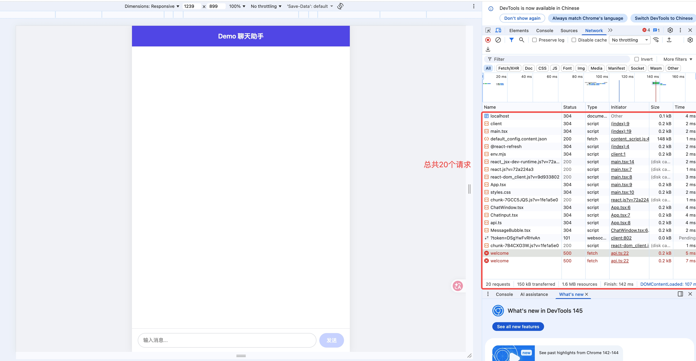
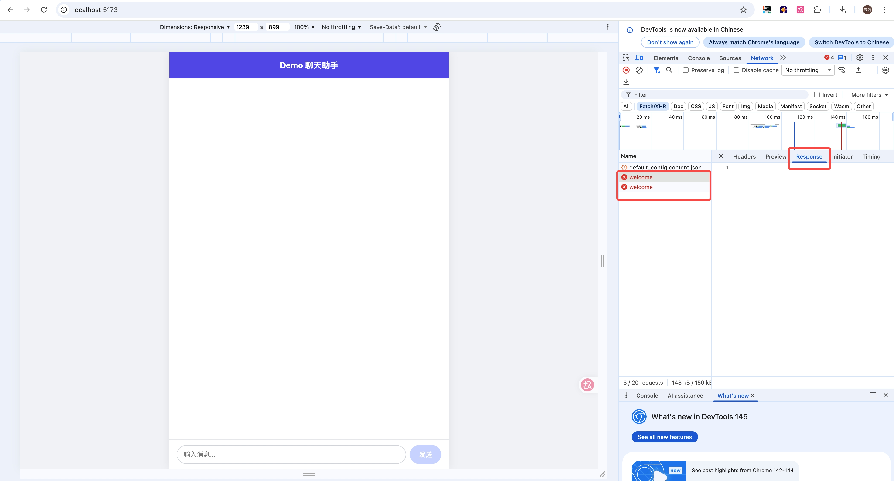

# 第1课作业

## 任务1：看看页面发了哪些请求

我打开了 demo 项目，并在浏览器 DevTools 的 Network 面板里刷新页面进行了观察。

### 1. 页面一共发了多少个网络请求
我观察到页面一共发出了 **20 个** 网络请求。

### 2. 请求数截图

### 3. 我找到的一个 API 请求
我找到了一条 **Fetch/XHR** 类型的请求，名称是 **welcome**。

### 4. Response 返回了什么
我观察到 `welcome` 这个请求前面显示红色错误标记，说明这个请求当前没有成功返回，因此在 Response 面板里没有看到正常的返回数据。

### 5. API 请求截图
