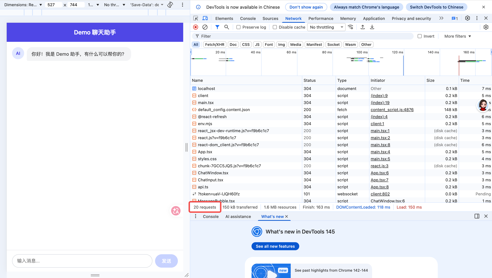
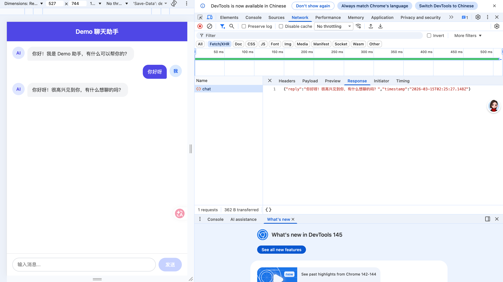
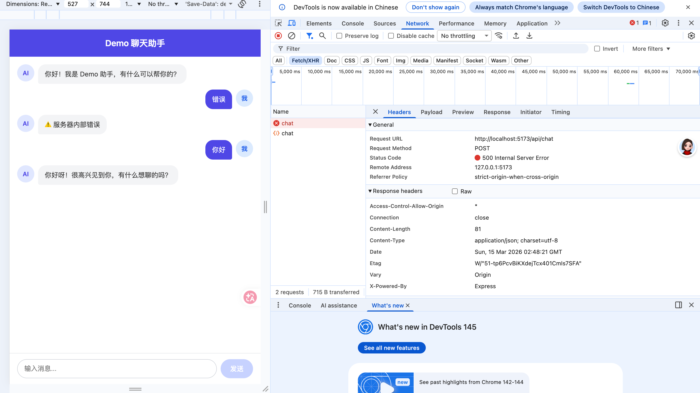
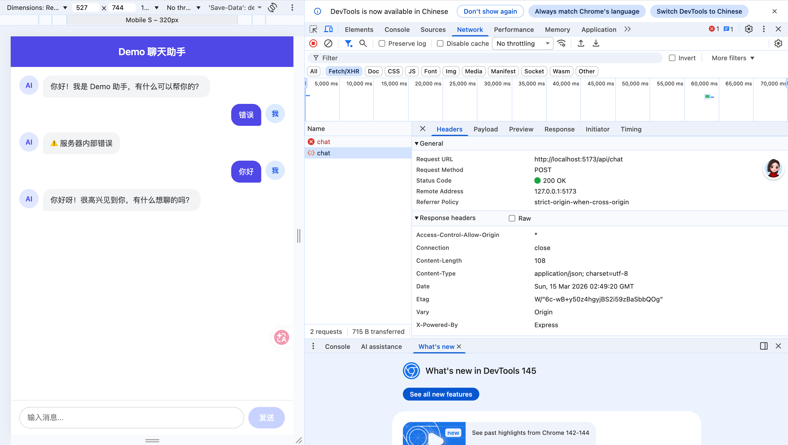

# 第1课作业

## 任务1：看看页面发了哪些请求

我打开了 demo 项目，并在浏览器 DevTools 的 Network 面板里刷新页面进行了观察。

### 1. 页面一共发了多少个网络请求
我观察到页面刷新后，一共发出了 **20 个** 网络请求。

### 2. 请求数截图


### 3. 我找到的一个 API 请求
我找到了一条 **Fetch/XHR** 类型的请求，名称是 **chat**。

### 4. Response 返回了什么
这个请求返回的是一段 JSON 数据，里面包含了：
- `reply`：AI 返回的回复内容
- `timestamp`：返回时间

我在截图里看到，这次返回的 `reply` 内容大致是：“你好呀！很高兴见到你，有什么想聊的吗？”

### 5. API 请求截图


## 任务2：触发一个错误请求

我先在聊天框里输入了“错误”并发送，然后又输入了“你好”并发送，对比了两次请求的区别。

### 1. 输入“错误”后的现象
当我输入“错误”并发送后，Network 面板里新增了一条 `chat` 请求。  
这条请求显示为红色，说明请求失败了。  
它的状态码是 **500 Internal Server Error**。



### 2. 输入“你好”后的现象
当我输入“你好”并发送后，Network 面板里也新增了一条 `chat` 请求。  
这条请求颜色正常，说明请求成功了。  
它的状态码是 **200 OK**。



### 3. 我观察到的区别
我观察到，输入“错误”时，请求会失败，请求在 Network 面板里显示为红色，状态码是 500。  
而输入正常消息“你好”时，请求能够成功返回，颜色正常，状态码是 200。  
这说明同样是发送 `chat` 请求，但后端会根据输入内容返回不同结果，前端也会根据返回结果展示正常回复或错误提示。

## 任务3：画一张“项目地图”

我选择用 `lesson1-demo` 这个 Demo 项目来整理它的项目结构。下面是我理解的项目地图。

```text
lesson1-demo/
├── client/                              [前端]
│   ├── src/                             [前端源码目录]
│   │   ├── components/                  [前端组件目录]
│   │   ├── api.ts                       [前端请求接口的文件，负责调用后端 API]
│   │   ├── App.tsx                      [前端主组件，负责组织整个页面]
│   │   ├── main.tsx                     [前端入口文件，负责启动 React 应用]
│   │   └── styles.css                   [页面样式文件]
│   ├── index.html                       [前端 HTML 入口文件]
│   ├── package-lock.json                [前端依赖锁定文件]
│   ├── package.json                     [前端依赖和脚本配置文件]
│   ├── tsconfig.json                    [前端 TypeScript 配置文件]
│   └── vite.config.ts                   [Vite 构建工具配置文件]
│
├── server/                              [后端]
│   ├── index.ts                         [后端入口文件，负责启动服务器和处理接口]
│   ├── replies.ts                       [后端回复逻辑文件，负责根据输入返回不同内容]
│   ├── package-lock.json                [后端依赖锁定文件]
│   ├── package.json                     [后端依赖和脚本配置文件]
│   └── tsconfig.json                    [后端 TypeScript 配置文件]
│
└── README.md                            [项目说明文件]

文件分类总结

前端文件
	•	client/src/api.ts：前端请求接口的文件，负责向后端发送请求。
	•	client/src/App.tsx：前端主组件，负责组织整个页面。
	•	client/src/main.tsx：前端入口文件，负责启动 React 应用。
	•	client/src/styles.css：页面样式文件。
	•	client/src/components/：前端组件目录，放聊天窗口、消息气泡、输入框等组件。
	•	client/index.html：前端 HTML 入口文件。

后端文件
	•	server/index.ts：后端入口文件，负责启动服务器和处理接口。
	•	server/replies.ts：后端回复逻辑文件，负责根据不同输入返回不同结果。

配置文件
	•	client/package.json：前端依赖和脚本配置。
	•	client/package-lock.json：前端依赖锁定文件。
	•	client/tsconfig.json：前端 TypeScript 配置。
	•	client/vite.config.ts：前端构建工具配置。
	•	server/package.json：后端依赖和脚本配置。
	•	server/package-lock.json：后端依赖锁定文件。
	•	server/tsconfig.json：后端 TypeScript 配置。

说明文件
	•	README.md：项目说明文档。
