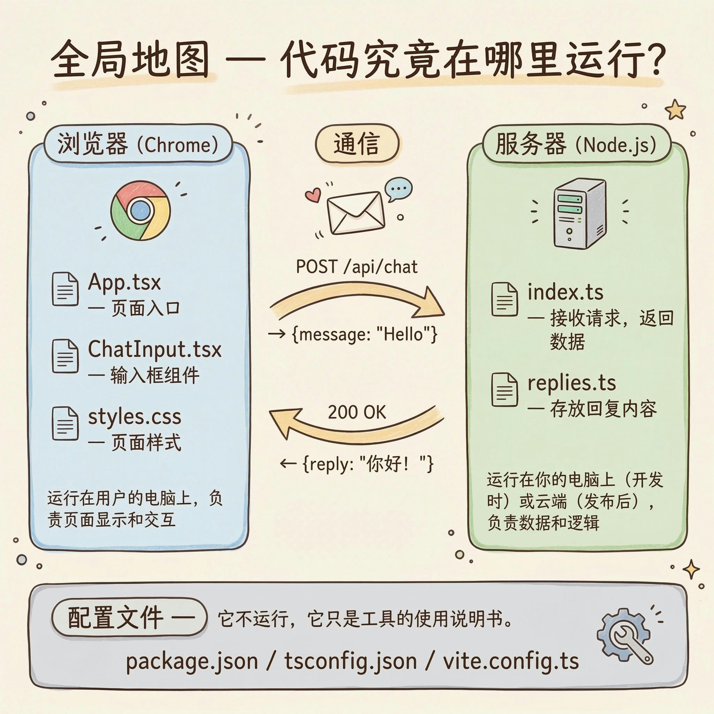

# 第 1 课：全局地图 — 代码到底在哪里运行

> 目标：让学员建立"一个网页从输入 URL 到展示内容"的完整心智模型，能分清前端/后端/配置文件的职责，并学会用 DevTools 验证自己的理解。

## 课前准备

### 讲师侧

- [ ] 选定一个 Demo 项目（团队现有的简单项目，要求：React 前端 + 后端接口调用 + 文件数不多）
- [ ] 确认 Demo 项目本地能跑通（`npm install && npm run dev`）
- [ ] 提前在 Chrome DevTools 里把 Network 面板调到 "All" 标签，关掉 "Disable cache"
- [ ] 开启屏幕录制工具
- [ ] 打开一个共享文档（飞书文档），用于记录课上的发散问题

### 学员侧（课前发给他们）

- [ ] 安装 Chrome 浏览器
- [ ] 安装 VS Code
- [ ] 安装 Node.js（LTS 版本）
- [ ] 安装 Git
- [ ] 把 Demo 项目 clone 到本地、跑起来（提供具体命令）

> **提示**：环境搭建指南单独发，搞不定的课前单独帮。不要把这个留到课上做。

---

## 课程流程

### 0:00-0:05 — 开场 & 破冰

**目的**：缓解紧张感，降低"学代码"的心理门槛。

**话术**：

> 先说一下这门课的定位——我们不是要把你们变成程序员。你们已经在用 AI 写代码了，也跑通过一些项目。这系列课要解决的是一个问题：**AI 写的那些代码，到底在干嘛？**
>
> 今天是第一课，我们从最宏观的视角开始。你在浏览器里输入一个网址、按下回车，到页面出现——这中间到底发生了什么？弄清楚这件事，后面你再看 AI 生成的任何代码，都能知道它属于哪个环节。

**动作**：

- 共享屏幕，打开浏览器，输入 Demo 项目的本地地址（`localhost:5173`）
- 页面加载，出现欢迎消息
- 在输入框打一句"你好"，点发送，等 500ms 收到回复
- 再发一句"今天天气怎么样"，又收到回复
- 「就这么简单——一个聊天页面，你发消息，它回消息。但这背后其实有两个程序在配合：一个跑在浏览器里画页面，一个跑在你电脑上处理消息。接下来我们打开"引擎盖"看看里面怎么转的。」

---

### 0:05-0:12 — 请求链路：从 URL 到页面

**目的**：建立"浏览器 → 服务器 → 浏览器"的往返心智模型。

**话术 + 演示**：

> 我用最简单的类比来说。你在浏览器里输入一个地址，就像你在餐厅里下单。
>
> 1. **你说了一个名字**（URL）——"我要去 xxx.com"
> 2. **服务员查座位表**（DNS）—— 把名字翻译成一个具体的地址（IP 地址），你不需要记 IP，记名字就行
> 3. **厨房收到订单**（服务器）—— 服务器接到请求，决定返回什么内容
> 4. **菜端上来**（HTML/CSS/JS）—— 浏览器收到一堆文件，开始"摆盘"——把页面画出来
> 5. **你吃的过程中还要加菜**（API 请求）—— 页面加载后，JS 代码会再发请求去拿数据，比如用户信息、列表数据

**演示步骤**：

1. 按 `Cmd+Option+I` 打开 DevTools → 切到 **Network** 面板
2. 再发一条消息，指着新出现的 `chat` 请求：「看，你刚才点发送的那一下，浏览器偷偷给服务器发了一个请求，这就是前端和后端通信的过程。」
3. 刷新页面，指出瀑布流中的几类请求：
   - **第一个请求**（document 类型）：「这就是'下单'，浏览器去找服务器要页面」
   - **JS/CSS 文件**：「这些是'配料'，页面要长什么样、要有什么功能，都写在这些文件里」
   - **XHR/Fetch 请求**（API 调用）：「这些是'加菜'——页面画出来之后，代码又去服务器拿具体的数据」
5. 点击一个 API 请求，展开看 Response 里的 JSON 数据：「这就是服务器返回的原始数据，前端拿到这些数据，再渲染成你看到的页面样子」

**关键强调**：

> 记住这个模型：**浏览器 → 服务器 → 浏览器**。今天看到的所有东西，都在这个往返里面。

**展示全局地图示意图**：



---

### 0:12-0:22 — 前端和后端：谁在干什么

**目的**：让学员理解"前端文件"和"后端文件"的区别，能在项目目录中分辨它们。

**话术**：

> 刚才我们看到浏览器和服务器之间来回传东西。那个写代码的视角来看：
>
> - **前端代码**：跑在浏览器里的代码。负责"页面长什么样"和"用户点了按钮之后做什么"
> - **后端代码**：跑在服务器上的代码。负责"数据存在哪"和"业务逻辑怎么算"
> - **配置文件**：不跑在任何地方，是告诉工具"怎么打包/怎么启动/怎么部署"的说明书

**演示步骤**：

1. 在 VS Code 中打开 Demo 项目
2. 展开文件树，逐个指出：

```
lesson-demo/
├── client/                         ← 「前端代码——跑在浏览器里」
│   ├── index.html                  ← 「HTML 入口——浏览器最先拿到的文件」
│   ├── src/
│   │   ├── main.tsx                ← 「启动文件——整个前端从这里开始跑」
│   │   ├── App.tsx                 ← 「根组件——管理消息列表，是所有组件的'大门'」
│   │   ├── api.ts                  ← 「调后端的函数——前端通过这里跟后端通信」
│   │   ├── styles.css              ← 「样式——页面长什么样全写在这里」
│   │   └── components/
│   │       ├── ChatWindow.tsx      ← 「聊天窗口——显示所有消息」
│   │       ├── MessageBubble.tsx   ← 「消息气泡——一条消息长什么样」
│   │       └── ChatInput.tsx       ← 「输入框——用户打字和发送的地方」
│   ├── package.json                ← 「配置——前端用了哪些第三方库」
│   ├── tsconfig.json               ← 「配置——TypeScript 的设置」
│   └── vite.config.ts              ← 「配置——打包工具的设置（含代理转发到后端）」
│
├── server/                         ← 「后端代码——跑在你的电脑上（服务器）」
│   ├── index.ts                    ← 「服务器入口——接收请求、返回数据」
│   ├── replies.ts                  ← 「回复数据——模拟 AI 的回复内容」
│   ├── package.json                ← 「配置——后端用了哪些第三方库」
│   └── tsconfig.json               ← 「配置——TypeScript 的设置」
│
└── README.md                       ← 「说明书——项目介绍和启动方法」
```

> 「注意看——client 和 server 两个文件夹各有自己的 package.json，因为它们是两个独立的程序。前端跑在浏览器里，后端跑在你的电脑上，它们通过 API 请求互相通信。」

3. 打开 `client/src/App.tsx`，指出：「这就是前端代码——你能看到它在描述页面长什么样、消息列表怎么渲染」
4. 打开 `client/src/api.ts`，指出：「这个文件是前端和后端的'桥梁'——它用 fetch 函数给后端发请求」
5. 打开 `server/index.ts`，指出：「这是后端代码——它接收请求、返回数据，但不管页面长什么样」
6. 回到 Chrome DevTools Network 面板，点击 `chat` 请求：「刚才发消息时，`api.ts` 里的 fetch 发了一个 POST 请求到后端，`server/index.ts` 收到后返回了一条回复——就是你们在 Response 里看到的这段 JSON」

**关键强调**：

> 以后你看 AI 生成的任何文件，第一件事就是判断：**这个文件是给浏览器跑的，还是给服务器跑的？** 这决定了你应该怎么看它、怎么调试它。

---

### 0:22-0:27 — DevTools 三板斧

**目的**：让学员掌握最实用的三个 DevTools 面板，变成日常习惯。

**话术**：

> Chrome DevTools 是前端开发者最重要的工具，没有之一。你不需要全学，记住三个面板就够应付 80% 的场景：

**演示步骤**：

1. **Elements 面板**：
   - 右键页面上一个元素 → "检查"
   - 「这里你能看到页面的 HTML 结构，鼠标移上去，页面上对应的部分会高亮」
   - 「你还能直接改样式试试效果——比如改个颜色」（现场改一个 CSS 属性，页面立刻变）
   - 「注意：这里改了不会保存到代码里，刷新就没了。但它特别适合'试一下效果'」

2. **Network 面板**：
   - 「刚才已经看过了。核心就一件事：**你的页面发了几个请求、每个请求成功没有、返回了什么数据**」
   - 「刚才看到的都是成功的请求，现在我给你们看看失败是什么样的」

   **演示失败请求**（切换到错误演示分支）：

   在终端中停掉当前服务器，然后：
   ```bash
   git stash        # 暂存当前改动（如果有）
   git checkout demo-error-cases
   cd lessons/lesson-1/demo/server
   npx tsx watch index.ts
   ```

   然后直接在聊天框输入以下内容，每次发送后回到 Network 面板观察：

   - **500 错误** — 输入 `错误` 或 `error`：
     → 指出 Network 面板中红色的请求，状态码 `500`，点开看 Response 里的错误信息
     → 「500 是服务器自己出了问题，不是你的错。看到这个就找后端同学」

   - **超时** — 输入 `超时` 或 `timeout`：
     → 指出请求一直在转圈（Pending 状态），服务器没有响应
     → 「有时候服务器不是报错，而是根本不回你。这时候请求会一直 Pending，最后超时」

   - **正常 vs 异常对比** — 再输入一条正常消息（如 `你好`）：
     → 「看，同样的接口，输入不同的内容，结果完全不同。Network 面板能帮你一眼区分」

   **总结话术**：
   - 「记住三个数字：**4 开头是你的问题，5 开头是服务器的问题，2 开头是成功**」
   - 「以后页面出问题，第一反应不是看代码，而是打开 Network 看看请求有没有失败」

   **演示完毕后切回主分支**：
   ```bash
   # 停掉服务器 (Ctrl+C)
   git checkout main
   git stash pop    # 恢复之前的改动（如果有）
   ```

3. **Console 面板**：
   - 「这里会显示代码的报错信息。如果你的页面白屏了，来这里看看有没有红色错误」
   - 如果当前有报错，现场读一下：「报错信息一般这么读——先看最后一行，它告诉你哪个文件出了问题；再看红色的那一行，它告诉你错在哪」
   - 如果没有报错，手动在 Console 输入一个 `console.log('hello')` 演示：「代码里写 console.log，输出就会出现在这里，这是最简单的调试方式」

---

### 0:27-0:35 — LLM 知识点：AI 是怎么生成代码的

**目的**：通过一个现场实验，让学员直观理解 AI 生成代码的本质和局限。

**话术**：

> 插一个跟今天主题相关的知识点。你们天天在用 AI 写代码，但你们有没有想过，AI 到底是怎么"写"出来的？我们来做个实验。

**现场实验**（打开 ChatGPT / Cursor / 任意 AI 工具）：

**第一步：观察生成过程**

输入提示词：`用 JavaScript 写一个函数，判断一个字符串是不是回文`

> 你们注意看——回答是一个字一个字蹦出来的，不是一整段一起出现的。这不是为了动画效果，它**真的是**在一个一个生成。
>
> AI 做的事情本质上跟输入法联想一样：你打了"今天天气"，输入法提示"很好"。AI 就是一个超级强的联想机器——看到你的问题，然后一个词一个词地预测"下一个最可能出现的词是什么"，直到生成完整的回答。

**第二步：同样的问题，再问一遍**

把一模一样的提示词再发一次。

> 看，写法变了。变量名不一样、实现方式可能也不一样。因为每次预测都有随机性——就像骰子，每次扔结果都不同。所以你"昨天让 AI 写好了，今天再问怎么变了"，这是正常的。

**第三步：问一个它可能答错的问题**

输入提示词：`用 Express 写一个接口，用 req.getBody() 获取请求体`（注意：Express 里没有 `req.getBody()` 这个方法）

观察 AI 的回答：
- 如果 AI 照写了 → 「看，它没有报错，直接用了一个**不存在**的方法。这叫**幻觉（hallucination）**——AI 会一本正经地编造东西」
- 如果 AI 纠正了 → 「不错，这次它答对了。但换一个模型或者换个问法，它可能就会编造出来。AI 不是每次都会纠错的」

> 这就是为什么我们要学 DevTools——**AI 是你的助手，但 DevTools 是帮你验证它有没有说谎的工具**。它说"这个接口会返回数据"，你打开 Network 看一眼就知道了。

---

### 0:35-0:45 — 动手环节

**目的**：让学员亲手操作 DevTools，把刚才看到的东西变成自己的体验。

**话术**：

> 现在轮到你们了。打开你自己之前做过的 vibe coding 项目（或者我们的 Demo 项目），完成下面的任务。遇到卡住的地方随时说，我来看你的屏幕。

**任务清单**（投屏展示或发到群里）：

```
任务 1：打开 Chrome DevTools → Network 面板 → 刷新页面
       数一下你的页面一共发了几个网络请求？
       找到一个 API 请求，点开看 Response 里返回了什么数据。
       截图发到群里。

任务 2：在聊天框里输入"错误"两个字，发送。
       观察 Network 面板里多了什么？状态码是多少？颜色有什么变化？
       再输入一条正常消息，对比两次请求的区别。

任务 3（加分）：打开 Console 面板，看看有没有报错信息。
              如果有，把报错信息复制出来，我们一起看看是什么意思。
```

**讲师动作**：

- 让学员共享屏幕或轮流展示
- 主动巡视，发现卡住的人主动去帮
- 常见卡点预判：
  - **DevTools 找不到**：提示用 `Cmd+Option+I`（Mac）或 `F12`（Windows）
  - **Network 面板什么都没有**：需要刷新页面才能看到请求
  - **不知道哪个是 API 请求**：教他们用面板上的 "Fetch/XHR" 过滤按钮
  - **项目文件结构跟演示的不一样**：正常的，帮他们根据自己的项目找对应关系

---

### 0:45-0:50 — Git 最小流程（预热）

**目的**：教会 git add/commit/push 的最小操作，为下节课和交作业做铺垫。

**话术**：

> 接下来每次课的作业都要用 Git 来交。Git 是什么、为什么需要它，我们下节课详细讲。今天只教你们三个命令，能把作业提交上去就行。
>
> 大家课前已经把仓库 clone 下来了，所以不需要初始化，直接在仓库里操作。

**演示步骤**（在终端操作）：

```bash
# 1. 进入课程仓库目录
cd coding-setup

# 2. 告诉 Git "我要存哪些文件"
git add .

# 3. 存一个版本，附一句说明
git commit -m "第一次作业"

# 4. 推到 GitHub 上
git push
```

> 就这三步。`add` 是"把文件放到待归档区"，`commit` 是"正式归档并贴标签"，`push` 是"把归档好的东西传到 GitHub 上"。
>
> 下节课我们会详细讲 Git 的原理和更多操作，今天先会这三步就够了。

**动作**：如果时间允许，让学员跟着操作一遍。如果时间紧，告诉他们作业里练。

---

### 0:50-0:55 — 发散问题回答

**目的**：回答课上记录的发散问题。

**话术**：

> 来看看我们课上记下的问题。（打开共享文档）
>
> 我挑一两个大家可能都有的问题回答一下，其余的我课后在文档里文字回复。

**操作**：

- 从共享文档中挑 1-2 个最有代表性的问题当场回答
- 如果没有记录的问题，主动问：「有什么今天听到的东西是觉得没太懂的吗？」
- 其余问题标记"待回复"，课后在文档中补充文字答案

---

### 0:55-1:00 — 布置作业 + 预告

**话术**：

> 今天的作业：

**作业内容**（发到群里）：

```
第 1 课作业：画一张"项目地图"

1. 打开你自己做的 vibe coding 项目（或 Demo 项目）
2. 列出所有重要的文件/文件夹
3. 每个文件用一句话说明它的作用
4. 标注哪些是"前端文件"、哪些是"后端文件"、哪些是"配置文件"

格式不限——可以用文本列表、可以手绘拍照、可以用任何你顺手的工具。

提交方式：在课程仓库里创建一个以你名字命名的文件夹，把作业文件放进去，用 git add / commit / push 提交。
```

**预告下节课**：

> 下节课我们讲 **Git**——代码的存档与协作。为什么需要它、怎么用它管理代码版本、改崩了怎么回退。从下节课开始，所有作业都通过 Git 提交。

---

## 备课检查清单

| 项目 | 状态 |
|---|---|
| Demo 项目选定 | ☐ |
| Demo 项目本地能跑通 | ☐ |
| Demo 项目有 API 调用（Network 面板能看到 XHR/Fetch 请求） | ☐ |
| Demo 项目文件结构清晰（能看出前端/后端/配置的分区） | ☐ |
| 学员都装好了 Chrome + VS Code + Node.js + Git | ☐ |
| 学员都 clone 了 Demo 项目并跑通了 | ☐ |
| 共享问题文档已创建 | ☐ |
| 录屏工具已准备 | ☐ |
| 作业文本已写好，可以直接发群里 | ☐ |

## 应急预案

| 情况 | 应对 |
|---|---|
| 学员环境没装好，课上跑不了项目 | 让他看你的屏幕跟着理解，课后单独帮装环境。不要花课上时间装环境 |
| DevTools 里看不到 API 请求 | 检查项目是否有后端接口调用。如果没有，用浏览器打开任意网站（比如掘金）演示 Network 面板 |
| 动手环节学员完全卡住不动 | 主动共享他们的屏幕，手把手带一遍。先陪他做完第一个任务，后面通常就能自己走了 |
| 发散问题太多，时间不够 | 严格执行"先记到文档，课末统一处理"。如果课末也不够，说"这些问题都很好，我课后在文档里详细回答" |
| 课程进度比预期快（还剩很多时间） | 让学员当场开始做作业，你在旁边实时指导 |

## 关键原则提醒

1. **一个核心概念**：浏览器 → 服务器 → 浏览器。所有内容围绕这个展开，不跑偏。
2. **用类比不用术语**：先说"下单→厨房→上菜"，学员理解了再引入正式术语。
3. **演示优先于讲解**：能动手演示的就不要纯嘴说。改一个 CSS 属性比解释十分钟"什么是样式"有用。
4. **暴露卡点**：动手环节务必让学员共享屏幕或截图。沉默不代表懂了，可能是卡住了不好意思说。
5. **不贪多**：宁可把一个概念讲透，也不要塞更多内容。今天只需要他们记住三件事——请求链路、前端vs后端、DevTools 三板斧。
